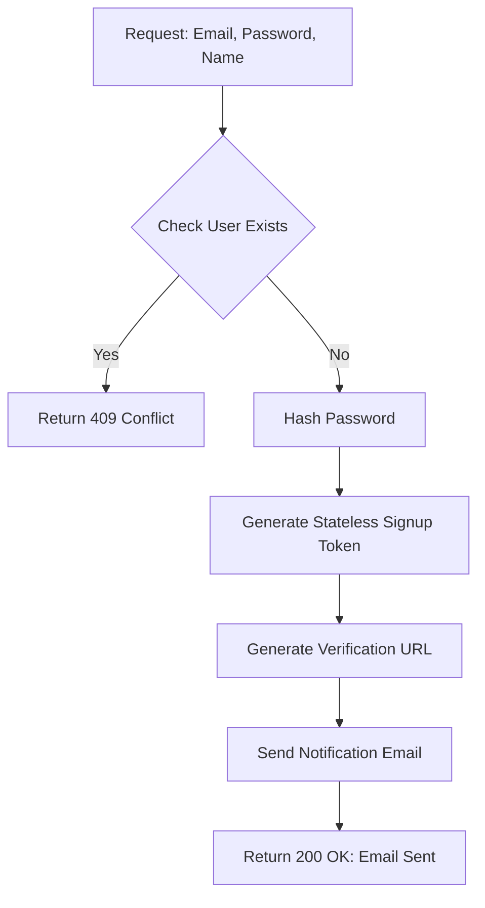
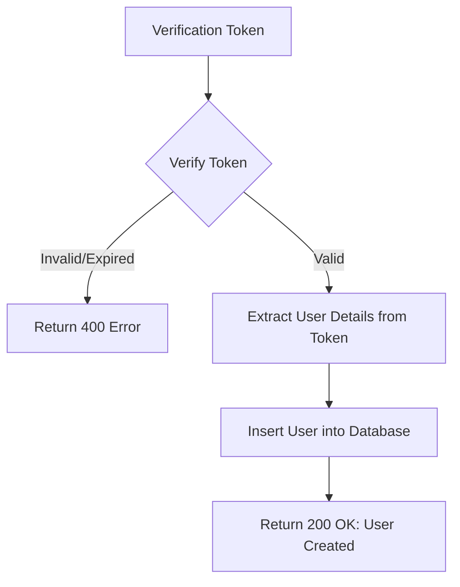
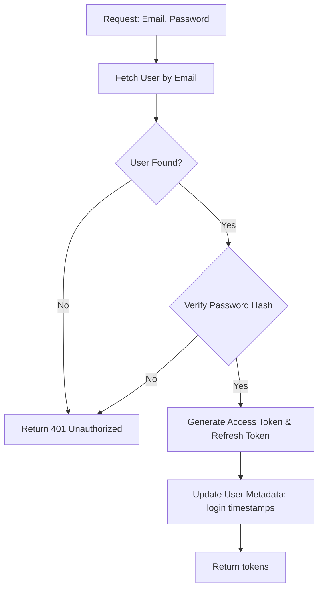
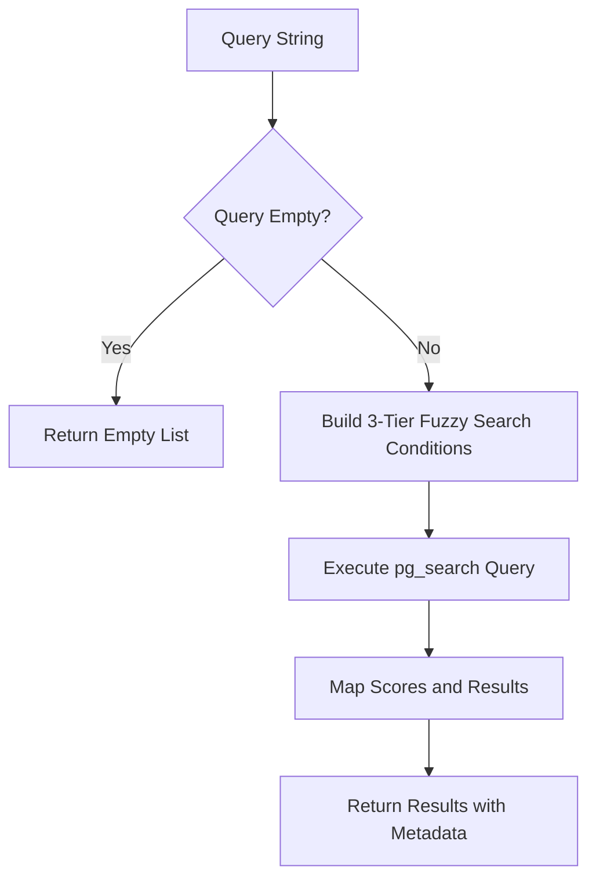
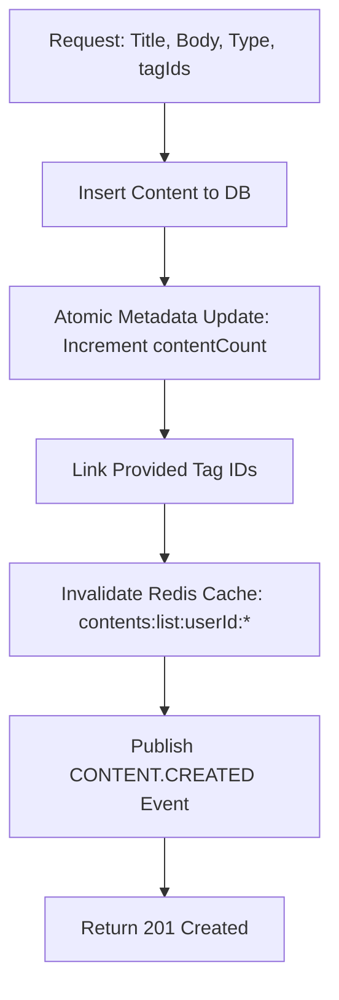
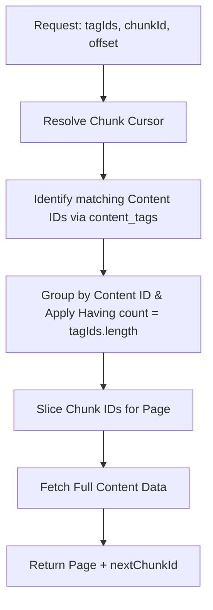
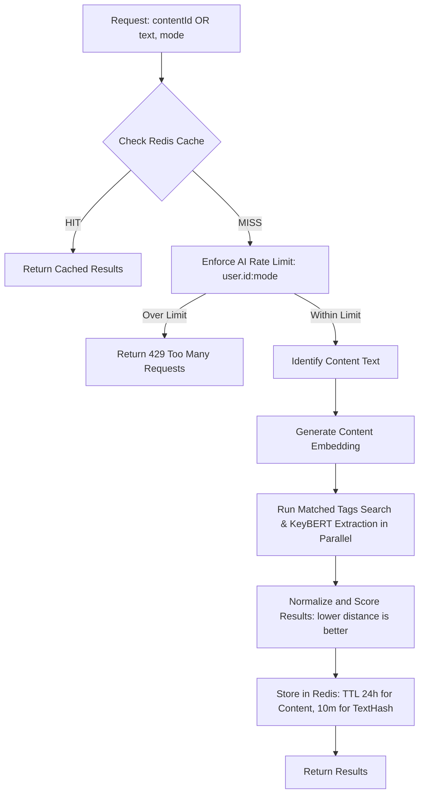
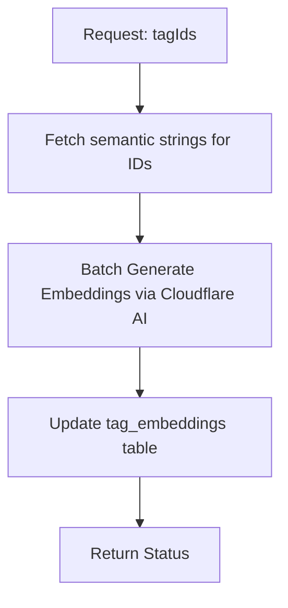
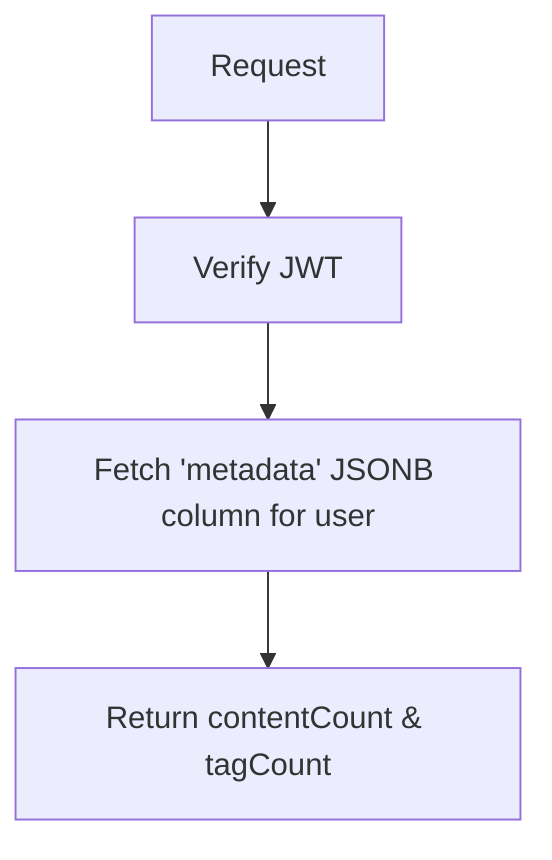

# Vekku-Bun API Flow Documentation

This document provides a detailed overview of the API endpoints, their internal logic, and the data flow within the system.

## Authentication Module

### 1. Request Signup (Stateless)
- **Endpoint:** `POST /auth/signup/request`
- **Logic:** Validates if the user exists, hashes the password, and generates a stateless signup token (JWT).
- **Flow:**


### 2. Verify Signup (Account Creation)
- **Endpoint:** `GET /auth/signup/verify?token=...`
- **Logic:** Verifies the signup token and persists the user in the database.
- **Flow Chart:**


### 3. Login
- **Endpoint:** `POST /auth/login`
- **Logic:** Verifies credentials and returns Access/Refresh tokens.
- **Flow Chart:**


---

## Tag Management Module

### 1. Create Tag(s)
- **Endpoint:** `POST /api/tag`
- **Logic:** Batch creates tags for a user. Atomic metadata updates and event-driven learning.
- **Flow Chart:**
```mermaid
graph TD
    A[Request: { tags: [...] }] --> B[Normalize Semantic Names]
    B --> C[Batch Insert into Database]
    C --> D{New Tags Inserted?}
    D -- Yes --> E[Atomic Metadata Update: Increment tagCount]
    D -- No/Update --> F[Invalidate Redis Cache: tags:list:userId:*]
    E --> F
    F --> G[Invalidate Redis Cache: suggestions:*:userId:*]
    G --> H[Publish TAG.CREATED Event per tag]
    H --> I[Return 201 Created]
    H -.-> J[Background: Listener generates embeddings]
```

### 2. Search Tags (Fuzzy)
- **Endpoint:** `GET /api/tag?q=...`
- **Logic:** Uses ParadeDB `pg_search` (BM25) for high-performance fuzzy matching.
- **Flow Chart:**


---

## Content Module

### 1. Create Content
- **Endpoint:** `POST /api/content`
- **Logic:** Persists content, links tags, updates counters, and triggers auto-learning.
- **Flow Chart:**


### 2. Get Contents by Tags
- **Endpoint:** `GET /api/content/by-tags?tagIds=...`
- **Logic:** AND-logic filtering. Finds content containing ALL specified tags. Uses standard chunked pagination.
- **Flow Chart:**


---

## AI Suggestions Module

### 1. Generate Suggestions
- **Endpoint:** `POST /api/suggestions/generate`
- **Logic:** Cache-first, on-demand AI matching and keyword extraction.
- **Flow Chart:**


### 2. Learn Tags (Manual Relearn)
- **Endpoint:** `POST /api/suggestions/tags/relearn`
- **Logic:** Forces vector generation for existing tags.
- **Flow Chart:**


---

## Stats Module

### 1. Dashboard Stats
- **Endpoint:** `GET /api/stats`
- **Logic:** O(1) retrieval from user metadata. No table scans.
- **Flow Chart:**

